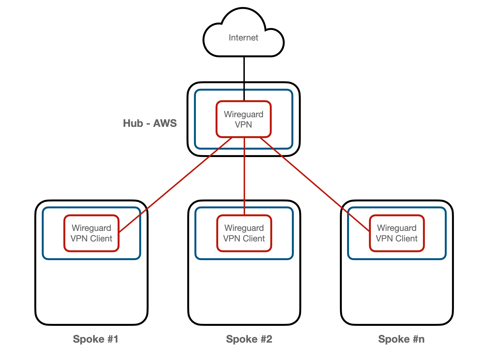

# Wireguard VPN Hub - Spoke

NOTE: This is not a production ready setup.

An example of a wireguard VPN hub and spoke setup. It is configured for the spokes to connect
securely to the hub and then access the internet. 

Routing from spoke-to-spoke via the hub is supported. The hub's wireguard configuration has knowledge
of all the local networks at each spoke (via configuration) and can route traffic to the appropriate
spoke. The spokes all MASQUERADE traffic leaving their primary interface to keep routing knowledge
localised at the hub.

The hub is built on AWS and listens for VPN connections from the spoke sites. The spokes gateways need
to be built outside this project and configured to the point where ssh access using a private key works.
The project configures them to forward traffic and installs and configures wireguard.

The operating systems I have used are:

- hub: Ubuntu 22.04 LTS
- spoke: Raspberry Pi OS Lite 64bit, 22-09-2022

[Terraform](https://www.terraform.io/) is used to create the infrastructure.

[Ansible](https://docs.ansible.com/ansible_community.html) is used to configure the servers.

I've tried to keep it as simple and clear as possible - if you know terraform and ansible it is hopefully
very easy for you to follow.

## Network

The built network looks like this:

The hub server runs a wireguard VPN to accept connections from multiple spokes. The routing and iptables configurations 
are set in the `post-up.sh` and `pre-down.sh` scripts installed with the configuration in `/etc/wireguard`. The hub also 
runs `stubby` for secure DNS over TLS; the default configuration uses cloudflare for this service but can be overridden 
with variables in `terraform.tfvars`.

The spoke servers run wireguard with a configuration to correctly connect to the hub. The routing and iptables configuration
are also configured in the VPN post-up/pre-down scripts. These scripts set the default route to be the VPN server.

## Setup

### Configuration

Copy the `terraform.tfvars.example` to `terraform.tfvars` and fill in the variables with your 
custom values. The example tfvars file contains the minimum that you need to change, however you
can customise more by overriding any of the variables in `variables.tf`

### Build The Infrastructure

To build the cloud VPC and server, run:

    terraform apply

This also creates ansible playbooks and roles to install software and configure the hub and spoke servers.

### Configure Servers

To configure all the servers (hub and spokes) at once:

    ./local/ansible/run-ansible.sh

To configure the hub only:

    ./local/ansible/run-ansible.sh -l hub

To configure one of the spokes, with hostname `spoke1`, run:

    ./local/ansible/run-ansible.sh -l spoke1

### Tear It Down

To destroy the hub run:

    terraform destroy

You will need to manually undo anything done on the spoke gateways.

### Testing

Check your routing with:

    traceroute -n 1.1.1.1

The output should show you traffic running via your hub.

