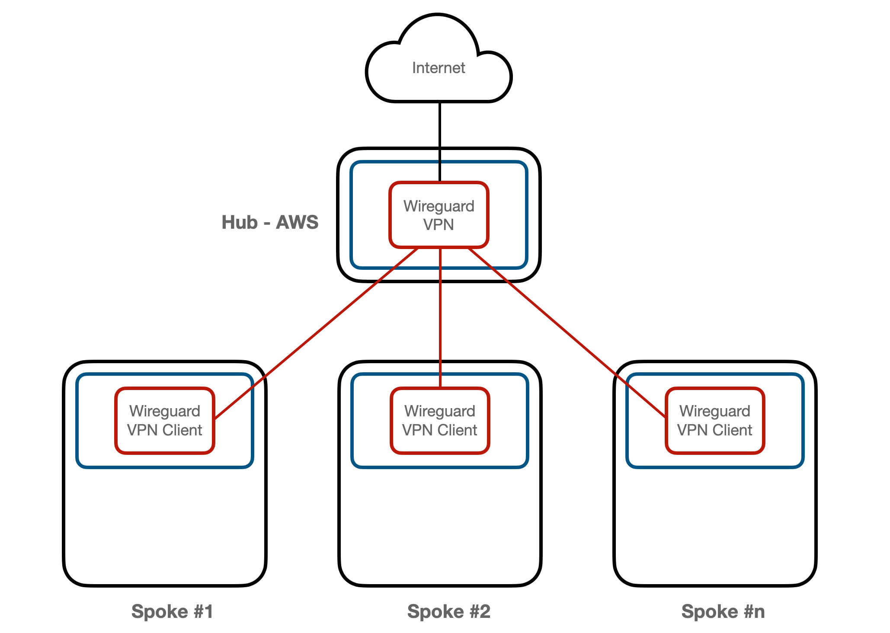

# 

## Network

The built network looks like this:

## Running The Playbook

To configure all machines, run:

     ./local/ansible/run-ansible.sh

To configure the hub only:

    ./local/ansible/run-ansible.sh -l hub

To configure one of the spokes only:

    ./local/ansible/run-ansible.sh -l spoke1

